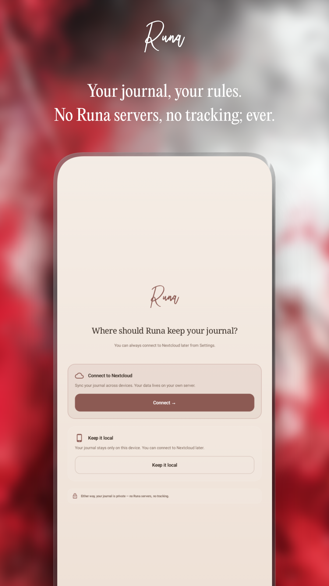
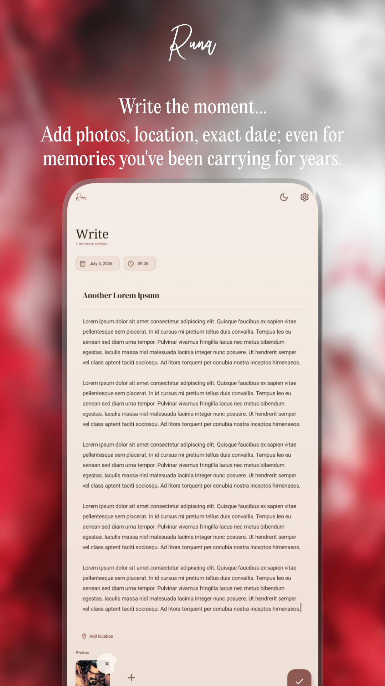
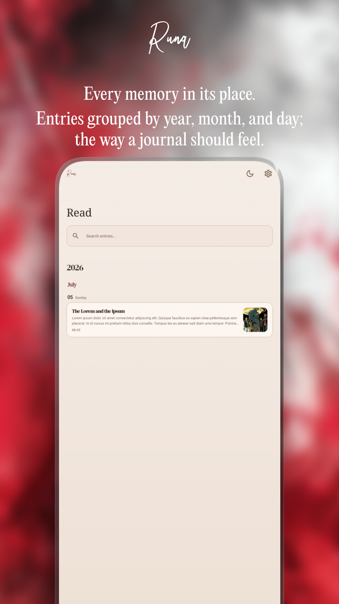
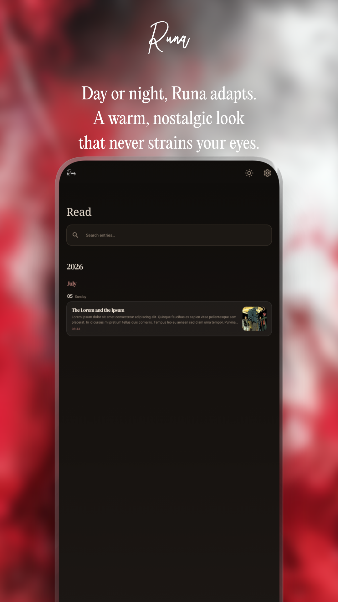

# Runa

**Everything under control.**

Runa is a private, personal journal for Android. Write down the moments that matter — with photos, location, and an exact date and time — and keep everything synced to your own Nextcloud server. No Runa servers, no accounts, no tracking; ever.

Part of the [BARBURAS](https://barburas.com) open-source Android suite.

---

## Screenshots

  
  
  
  

---

## Features

- **Write** — compose journal entries with a title, body, date/time, and up to 5 photos
- **Retroactive entries** — tappable date & time chips let you log memories from years ago, not just today
- **Photos** — attach from gallery or camera, with EXIF rotation correction and downsampling
- **Share-to-journal** — share one or more images from any app straight into Runa's Write screen
- **Read** — a chronological entry list grouped by year, month, and day
- **Map** — every entry with a location becomes a pin on your own personal map
- **Nextcloud sync** — Login Flow v2, works behind reverse proxies and Tailscale
- **Local-only mode** — or keep your journal entirely on-device, no server required
- **Biometric app lock**
- **Dark and light theme**, in-app text size control
- **Export** — download your entire journal and photos as a ZIP whenever you want
- **Privacy-first** — no analytics, no crash reporting, no ads

---

## Tech stack

- Kotlin + Jetpack Compose
- Material3
- Room (offline-first, local source of truth)
- Hilt
- OkHttp
- osmdroid (OpenStreetMap)
- Nextcloud WebDAV + Login Flow v2

---

## Build

1. Clone the repo
2. Open in Android Studio
3. Build and run on a device or emulator running Android 9+

No API keys required.

---

## A note on AI

Parts of this app were developed with AI assistance. I always disclose this upfront.

---

## Links

- [Play Store](https://play.google.com/store/apps/dev?id=6842866278906089090)
- [Privacy Policy](https://barburas.com/privacy-policy/)
- [Donate](https://bunq.me/barburasdonations)
- [More apps by BARBURAS](https://barburas.com)

---

## License

[GNU General Public License v3.0](LICENSE)

Copyright © 2026 BARBURAS
